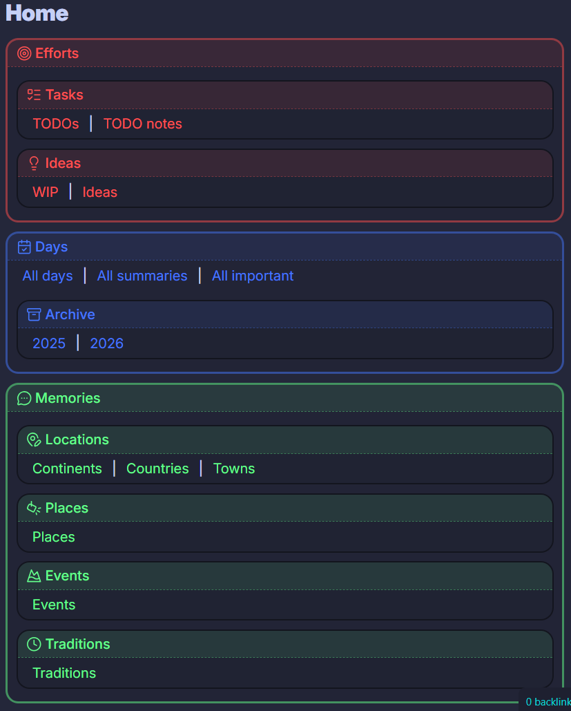

# LAIWM — Local AI Workflow Manager

A locally-running AI service that executes intelligent workflows against a personal Obsidian vault. No data leaves the machine — everything runs on-device via a local LLM.

Two workflows are implemented: **monthly_summary** and **semantic_search**.

---

## Motivation

For over half a year I have been recording various aspects of my life in a git-synced Obsidian vault — daily notes, films watched, places visited, habits tracked. Over time it grew to the point where searching and summarising manually became impractical.

I wanted to bring AI capabilities to these notes, but the personal nature of the data ruled out any cloud service. LAIWM is the answer: a locally-running LLM pipeline that reads the vault directly and never sends data anywhere.

### Obsidian vault Home page


---

## Hardware

**Machine**: HP laptop — Intel Core Ultra with Intel Arc iGPU (17.92 GB shared VRAM).

The iGPU is the key hardware constraint that shaped every technical decision in this project.

| Setup | Result |
|---|---|
| LM Studio + Vulkan (Intel Arc) | Crashed mid-inference after ~4 batches |
| LM Studio + CPU only | Stable but ~2 hours per 30-note run |
| **Ollama + IPEX-LLM (SYCL/oneAPI)** | **Stable + relatively fast — minutes per response** |

[IPEX-LLM](https://github.com/intel-analytics/ipex-llm) provides a proper Intel GPU backend for Ollama via SYCL/oneAPI instead of Vulkan. Setup requires Miniforge, a dedicated `llm` conda environment, and a GPU-patched Ollama binary.

**Model progression** — each upgrade was justified by quality improvements:

| Model | Why |
|---|---|
| `qwen3:4b` | Initial choice — fit in RAM |
| `qwen3:8b` | Faster than the previous 4b despite being larger |
| **`qwen3:14b`** | **Significant intelligence step up; stable on IPEX-LLM — current** |

**Embedding model**: `nomic-embed-text` via Ollama.

> Qwen3 has thinking mode enabled by default. Every prompt appends `/no_think` to suppress it — without this, trivial responses take 10+ minutes.

---

## Development Setup

- **OS**: Windows 11 + WSL2 (Ubuntu)
- **Editor**: VSCode with WSL extension
- **AI assistant**: [Claude Code](https://claude.ai/code) — used throughout development for implementation, debugging, and architecture decisions
- **Python tooling**: [`uv`](https://github.com/astral-sh/uv) for dependency management

---

## Workflows

### `monthly_summary`

Reads all daily notes for a given month and produces a concise bullet-point summary of what actually mattered.

**Pipeline:**

```
collect month's .md notes
  → Pass 1: presummary per note (LLM × N)
            each note condensed to 1-3 bullets independently
  → Pass 2: batch synthesis (LLM × batches)
            condensed notes grouped and synthesized;
            prior batch outputs passed forward to prevent repetition
  → Pass 3: final consolidation (LLM × 1)
            all batches distilled to ≤25 key bullets
  → output file
```

Single-pass batching was tried first and abandoned — early notes lost detail as context grew. The three-pass approach keeps each note's contribution isolated before synthesis.

**Example:**
```
uv run manager.py --prompt "Summarize my 2026 march notes" --debug
[LAIWM 16:59:06] LAIWM — qwen3:14b @ http://172.x.x.x:11434
[LAIWM 16:59:06] Classifying request...
[DEBUG 16:59:20] Routing result: mode=monthly_summary confidence=100% params={'year': 2026, 'month': 3} missing=[]
[LAIWM 16:59:20] Mode: monthly_summary (confidence: 100%)
[DEBUG 16:59:20] Final params: {'year': 2026, 'month': 3, 'query': 'Summarize my 2026 march notes'}
[LAIWM 16:59:20] 31 notes → pre-summarizing...
  [1/31] 2026-03-01 ... [DEBUG 16:59:58] Response (425 chars): - Went on a Kektura trip, ate sushi for breakfast ...
done
... (rest of the days were here)
[DEBUG 17:14:36] Synthesis: 31 day summaries → 2 batch(es), limit=10444 chars
[LAIWM 17:14:36] Synthesizing 2 batch(es)...
  [1/2] 2026-03-01 → 2026-03-30 ... [DEBUG 17:16:04]  ...
done
  [2/2] 2026-03-31 → 2026-03-31 ... [DEBUG 17:17:06]  ...
done
[LAIWM 17:17:06] Final consolidation...
[DEBUG 17:19:00] Response (1700 chars): - János worked on AI projects and set up local LLM environments for better GPU support   - János registered an IBKR TBSZ account and invested in X   - János helped with X’s diploma defense and s ...
[LAIWM 17:19:00] Output written to **/obsidian_llm/output/monthly_summary_2026_03.md
```

---

### `semantic_search`

Answers a natural-language question by searching the entire vault. Combines vector similarity, keyword boosting, and question-focused summarization before synthesis.

**Pipeline:**

```
query
  → collect all .md files
  → embed files (nomic-embed-text, mtime-cached)
  → cosine score all notes against query vector
  → keep top 40%  (drops vocabulary noise from unrelated notes)
  → LLM keyword extraction  (content words only, no sentiment words)
  → keyword grep on top 40%
  → boosted score: vector × (1 + 0.1 × keyword_hit_count)
  → top 5 pool
  → presummary per note (LLM × 5)  — each note summarized with the question in mind
  → synthesis on 5 focused summaries (LLM × 1)
  → output file
```

Pure vector search failed on notes with overlapping vocabulary. The hybrid pipeline — vector pre-filter → keyword boost → question-focused presummary — solved the recall precision problem.

**Example:**

```
uv run manager.py --prompt "In which town did I live while attending highschool?" --debug
[LAIWM 16:44:43] LAIWM — qwen3:14b @ http://172.x.x.x:11434
[LAIWM 16:44:43] Classifying request...
[DEBUG 16:45:14] Routing result: mode=semantic_search confidence=95% params={'query': 'In which town did I live while attending highschool?'} missing=[]
[LAIWM 16:45:14] Mode: semantic_search (confidence: 95%)
[DEBUG 16:45:14] Final params: {'query': 'In which town did I live while attending highschool?'}
[LAIWM 16:45:15] Stage 1 — scoring 473 notes...
[DEBUG 16:45:17] Kept top 40% (189/473 notes) by vector score
[LAIWM 16:45:17] Stage 2 — extracting keywords...
[DEBUG 16:45:24] Extracted keywords: ['town', 'highschool']
[DEBUG 16:45:24] Keyword matches: 26 files
[DEBUG 16:45:24] Synthesis pool (5):
[DEBUG 16:45:24]   0.677  Nyirbator Hungarian - English Two Language Elementary School.md  |  --- tags:   - memo/chapters/education country: "[[Hungary]]" town: "[[Nyirbator]]" start: 2008-09 en
[DEBUG 16:45:24]   0.644  Eindhoven.md  |  --- tags:   - memo/loc/towns/netherlands   - lived-here type: town country: "[[Netherlands]]" region
[DEBUG 16:45:24]   0.626  Krudy Gyula High school.md  |  --- tags:   - memo/chapters/education country: "[[Hungary]]" town: "[[Nyiregyhaza]]" start: 2016-09 
[DEBUG 16:45:24]   0.618  Nyiregyhaza Apaczai Csere Janos Elementary School.md  |  --- tags:   - memo/chapters/education country: "[[Hungary]]" town: "[[Nyiregyhaza]]" start: 2011-12 
[DEBUG 16:45:24]   0.592  Nyircsaszari.md  |  --- tags:   - memo/loc/towns/hungary   - lived-here type: village country: "[[Hungary]]" region: Sza
[LAIWM 16:45:24] Stage 3 — pre-summarizing 5 notes with question in mind, then synthesizing...
[DEBUG 16:45:51]   presummary Nyirbator Hungarian - English Two Language Elementary School.md: Rating: N/A (not applicable as no formal rating is given). Recommendation: N/A. Genre: Personal memoir.
[DEBUG 16:46:18]   presummary Eindhoven.md: (ommitted)  
[DEBUG 16:46:45]   presummary Krudy Gyula High school.md: I lived in Nyiregyhaza while attending Krudy Gyula High School from 2016 to 2020.
[DEBUG 16:47:11]   presummary Nyiregyhaza Apaczai Csere Janos Elementary School.md: Rating: 4/5. Recommendation: Highly recommended for its strong educational reputation and memorable experiences, though 
[DEBUG 16:47:46]   presummary Nyircsaszari.md: You lived in Nyírcsászári, a small village in Szabolcs-Szatmar-Bereg County, Hungary
[DEBUG 16:55:37] Answer (481 chars): You lived in **Nyiregyhaza** while attending high school, as explicitly stated in the summary about attending **Krudy Gyula High School** from 2016 to 2020. While the Eindhoven summary mentions living ...
# Semantic Search

**Query**: In which town did I live while attending highschool?

## Answer

You lived in **Nyiregyhaza** while attending high school, as explicitly stated in the summary about attending **Krudy Gyula High School** from 2016 to 2020.

## Sources

(ommitted)
```

## Setup

### Windows — start the Ollama server

Requires Miniforge with the `llm` conda environment configured for IPEX-LLM. Open a Miniforge terminal:

```bat
conda activate llm
set OLLAMA_NUM_GPU=999
set ZES_ENABLE_SYSMAN=1
set SYCL_CACHE_PERSISTENT=1
set no_proxy=localhost,127.0.0.1
set OLLAMA_HOST=0.0.0.0
ollama serve
```

> `OLLAMA_HOST=0.0.0.0` is required — without it Ollama binds only to `127.0.0.1` and is unreachable from WSL2.

Pull the required models (one-time):

```bat
ollama pull qwen3:14b
ollama pull nomic-embed-text
```

### WSL2 — run LAIWM

```bash
# Clone and install
git clone https://github.com/GJanos/obsidian_llm
cd obsidian_llm
uv sync

# Set vault path (add to ~/.bashrc to make permanent)
export OBSIDIAN_LLM_VAULT_PATH="/path/to/your/obsidian/vault"

# Run
uv run manager.py --prompt "your request here"

# Run with debug output
uv run manager.py --prompt "your request here" --debug
```